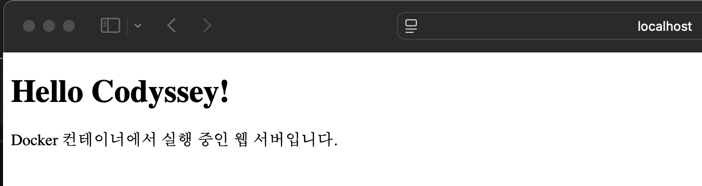
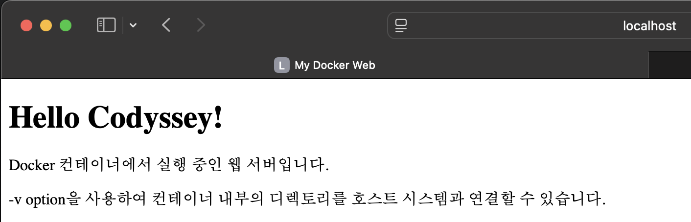

# E1_1 미션 연습 자료

이 README는 `/readme_ref.md`와 `/docs/mission_intro.md`를 참고하여 작성한 미션 수행 연습 문서입니다.

## 1. 미션 개요

- 목표: 개발 워크스테이션 환경에서 터미널, Docker, Git/GitHub를 활용해 재현 가능한 실행 환경을 구성하고 검증합니다.
- 핵심 활동:
  - 터미널과 파일 시스템 기본 조작
  - 파일/디렉터리 권한 실습
  - Docker 설치 및 기본 명령 점검
  - Docker 컨테이너 실행 및 로그 확인
  - Dockerfile 기반 커스텀 웹 서버 이미지 빌드
  - 포트 매핑 접속 확인
  - 바인드 마운트와 Docker 볼륨 검증
  - Git 사용자 설정 및 GitHub 연동

## 2. 실행 환경

- OS: macOS
- Shell: zsh
- Docker: `docker --version`로 버전 확인
```bash
mpeg46551@c5r1s2 ~ % docker --version
Docker version 28.5.2, build ecc6942
```
- Git: `git --version`로 버전 확인
```bash
mpeg46551@c5r1s2 ~ % git --version
git version 2.53.0
```

## 3. 수행 항목

- [x] 터미널 기본 조작: 현재 위치, 파일/디렉터리 생성·이동·삭제, 내용 확인
- [x] 권한 실습: 파일 1개와 디렉터리 1개에 대해 권한 변경 전/후 비교
- [x] Docker 설치 및 실행 점검: `docker --version`, `docker info`
- [x] Docker 이미지/컨테이너 조회: `docker images`, `docker ps -a`
- [x] `hello-world` 실행 성공 확인
- [x] `ubuntu` 컨테이너 내부 진입 후 `ls`, `echo` 실행
- [x] `docker attach`와 `docker exec` 차이 관찰
- [x] Dockerfile 기반 커스텀 웹 서버 이미지 빌드
- [x] 포트 매핑으로 웹 접속 확인
- [x] 바인드 마운트 파일 변경 반영 확인
- [x] Docker 볼륨 영속성 검증
- [x] Git 설정 및 GitHub 연동

## 4. 수행 방법 및 예시

### 4.1 터미널 기본 조작

```bash
mpeg46551@c5r1s2 ~ % cd ~

mpeg46551@c5r1s2 ~ % pwd

mpeg46551@c5r1s2 ~ % ls    
Desktop		Downloads	Library		Music		Pictures
Documents	E1_1		Movies		OrbStack	Public


mpeg46551@c5r1s2 ~ % ls -a
.			.lesshst		Downloads
..			.orbstack		E1_1
.CFUserTextEncoding	.ssh			Library
.DS_Store		.vscode			Movies
.Trash			.zsh_history		Music
.copilot		.zsh_sessions		OrbStack
.docker			Desktop			Pictures
.gitconfig		Documents		Public

mpeg46551@c5r1s2 ~ % cd E1_1
mpeg46551@c5r1s2 E1_1 % ls -al
total 72
drwxr-xr-x  10 mpeg46551  mpeg46551    320 Apr  4 15:56 .
drwxr-x---+ 24 mpeg46551  mpeg46551    768 Apr  4 15:57 ..
drwxr-xr-x  16 mpeg46551  mpeg46551    512 Apr  4 15:48 .git
-rw-r--r--   1 mpeg46551  mpeg46551   4614 Apr  4 15:59 README.md
drwxr-xr-x   4 mpeg46551  mpeg46551    128 Apr  3 21:39 docker1
drwxr-xr-x  10 mpeg46551  mpeg46551    320 Apr  4 15:45 docs
-rw-r--r--   1 mpeg46551  mpeg46551   9929 Apr  2 19:13 e1_1.md
drwxr-xr-x   3 mpeg46551  mpeg46551     96 Apr  2 19:13 logs
-rw-r--r--   1 mpeg46551  mpeg46551  12332 Apr  4 15:56 readme_ref.md
drwxr-xr-x   3 mpeg46551  mpeg46551     96 Apr  2 19:13 test-dir

$ mkdir test-dir

$ ls
app/  docs/  e1_1.md  logs/  README.md  test-dir/

$ cd test-dir

$ pwd
/d/git/E1_1/test-dir

$ touch hello.md

$ ls
hello.md

$ cat hello.md

$ echo "hello codyssey" >> hello.md

$ cat hello.md
hello codyssey

$ cp hello.md hello1.md

$ ls
hello.md  hello1.md

$ mv hello1.md hello2.md

$ ls
hello.md  hello2.md

$ rm hello2.md

$ ls
hello.md

```

### 4.2 권한 실습
| 구분 | 권한 기호 | (rwx),의미 |
| --- | --- | ---|
| -| 일반적인 파일 | 텍스트, 이미지, 실행 파일 등)을 의미합니다.
|d | 디렉토리 | (Directory), 즉 폴더를 의미합니다.|
| l |  바로가기 | 아이콘 같은 심볼릭 링크를 의미합니다. |
|r| Read | 읽기 권한 (내용 보기) |
|w | rite | 쓰기 권한 (수정, 삭제) |
| x |Execute | 실행 권한 (프로그램 실행) |
| - | None | 해당 권한 없음 |

```bash
mpeg46551@c5r1s2 E1_1 % cd test-dir
mpeg46551@c5r1s2 test-dir % echo "sample" >> sample.txt
mpeg46551@c5r1s2 test-dir % ls -l
total 16
-rw-r--r--  1 mpeg46551  mpeg46551  15 Apr  2 19:13 hello.md
-rw-r--r--  1 mpeg46551  mpeg46551   7 Apr  4 16:10 sample.txt
mpeg46551@c5r1s2 test-dir % chmod 744 sample.txt
mpeg46551@c5r1s2 test-dir % ls -l
total 16
-rw-r--r--  1 mpeg46551  mpeg46551  15 Apr  2 19:13 hello.md
-rwxr--r--  1 mpeg46551  mpeg46551   7 Apr  4 16:10 sample.txt

mpeg46551@c5r1s2 test-dir % mkdir folder
mpeg46551@c5r1s2 test-dir % ls -l
total 16
drwxr-xr-x  2 mpeg46551  mpeg46551  64 Apr  4 16:15 folder
-rw-r--r--  1 mpeg46551  mpeg46551  15 Apr  2 19:13 hello.md
-rwxr--r--  1 mpeg46551  mpeg46551   7 Apr  4 16:10 sample.txt
```


### 4.3 Docker 설치 및 점검

```bash
brew install --cask docker  #표준
brew install --cask orbstack #작고 빠름
mpeg46551@c5r1s2 test-dir % docker --version
Docker version 28.5.2, build ecc6942

mpeg46551@c5r1s2 test-dir % docker info
Client:
 Version:    28.5.2
 Context:    orbstack
 Debug Mode: false
 Plugins:
  buildx: Docker Buildx (Docker Inc.)
    Version:  v0.29.1
    Path:     /Users/mpeg46551/.docker/cli-plugins/docker-buildx
  compose: Docker Compose (Docker Inc.)
```

### 4.4 기본 Docker 명령
예: "프로젝트는 소스 코드(app/), 설정 파일(docker1/), 문서(docs/)로 구분하여 관리 효율성을 높였습니다."

```bash
mpeg46551@c5r1s2 test-dir % docker images
REPOSITORY    TAG       IMAGE ID       CREATED       SIZE
hello-world   latest    e2ac70e7319a   11 days ago   10.1kB

mpeg46551@c5r1s2 test-dir % docker ps -a
CONTAINER ID   IMAGE         COMMAND    CREATED        STATUS                    PORTS     NAMES
c9c920c75fc0   hello-world   "/hello"   19 hours ago   Exited (0) 19 hours ago             friendly_yalow

mpeg46551@c5r1s2 test-dir % docker logs c9c920c75fc0

Hello from Docker!
This message shows that your installation appears to be working correctly.

To generate this message, Docker took the following steps:
 1. The Docker client contacted the Docker daemon.
 2. The Docker daemon pulled the "hello-world" image from the Docker Hub.
    (amd64)
 3. The Docker daemon created a new container from that image which runs the
    executable that produces the output you are currently reading.
 4. The Docker daemon streamed that output to the Docker client, which sent it
    to your terminal.

To try something more ambitious, you can run an Ubuntu container with:

```


### 4.5 `hello-world` 및 `ubuntu`

```bash
mpeg46551@c5r1s2 test-dir % docker run -it ubuntu bash
Unable to find image 'ubuntu:latest' locally
latest: Pulling from library/ubuntu
817807f3c64e: Pull complete 
Digest: sha256:186072bba1b2f436cbb91ef2567abca677337cfc786c86e107d25b7072feef0c
Status: Downloaded newer image for ubuntu:latest 

root@aef087afd862:/# ls  
bin  boot  dev  etc  home  lib  lib64  media  mnt  opt  proc  root  run  sbin  srv  sys  tmp  usr  var

root@aef087afd862:/# exit
exit

mpeg46551@c5r1s2 test-dir % 

mpeg46551@c5r1s2 test-dir % docker images 
REPOSITORY    TAG       IMAGE ID       CREATED       SIZE
hello-world   latest    e2ac70e7319a   11 days ago   10.1kB
ubuntu        latest    f794f40ddfff   5 weeks ago   78.1MB

mpeg46551@c5r1s2 test-dir % docker ps -a
CONTAINER ID   IMAGE         COMMAND    CREATED         STATUS                     PORTS     NAMES
aef087afd862   ubuntu        "bash"     4 minutes ago   Exited (0) 2 minutes ago             musing_germain
c9c920c75fc0   hello-world   "/hello"   19 hours ago    Exited (0) 19 hours ago              friendly_yalow

mpeg46551@c5r1s2 test-dir % docker logs aef087afd862
  
root@aef087afd862:/# ls  
bin  boot  dev  etc  home  lib  lib64  media  mnt  opt  proc  root  run  sbin  srv  sys  tmp  usr  var

mpeg46551@c5r1s2 test-dir % docker stats --no-stream
CONTAINER ID   NAME      CPU %     MEM USAGE / LIMIT   MEM %     NET I/O   BLOCK I/O   PIDS
```

### 4.6 Dockerfile 기반 커스텀 이미지

- 베이스 이미지: `nginx` 또는 `nginx:stable-alpine`
1. nginx vs nginx:stable-alpine (무엇을 고를까?)
이 둘은 똑같은 웹 서버 프로그램(nginx)이지만, 그 밑바탕이 되는 **'OS의 무게'**가 다릅니다.

nginx (표준형):

**데비안(Debian)**이라는 리눅스를 기반으로 합니다.

우리가 흔히 쓰는 명령어(ls, cat, apt-get 등)가 다 들어있어 사용하기 편하지만, 용량이 큽니다 (약 100MB 이상).

nginx:stable-alpine (경량형 / 추천!):

**알파인(Alpine)**이라는 초경량 리눅스를 기반으로 합니다.

보안에 꼭 필요한 기능만 남기고 다 깎아냈습니다.

용량이 매우 작습니다 (약 10~20MB). 아이맥의 용량을 아끼고 속도를 높이려면 보통 이걸 씁니다.
- 커스텀 포인트: 정적 `index.html` 추가, `EXPOSE`, `CMD` 설정

- 빌드 예시:

```bash
mpeg46551@c5r1s2 docker1 % docker build -t my-web-img .
[+] Building 7.7s (7/7) FINISHED                                                                                                                                        docker:orbstack
 => [internal] load build definition from Dockerfile  0.2s
 => => transferring dockerfile: 792B    0.0s
 => [internal] load metadata for docker.io/library/nginx:stable-alpine    2.8s
 => [internal] load .dockerignore     0.1s
 => => transferring context: 2B      0.0s
 => [internal] load build context     0.2s
 => => transferring context: 192B  

 mpeg46551@c5r1s2 docker1 % docker images
REPOSITORY    TAG       IMAGE ID       CREATED         SIZE
my-web-img    latest    f228a01c58c9   5 minutes ago   62.1MB
hello-world   latest    e2ac70e7319a   11 days ago     10.1kB
ubuntu        latest    f794f40ddfff   5 weeks ago     78.1MB
mpeg46551@c5r1s2 docker1 % 
```

- 실행 예시:

```bash
docker run -d -p 8080:80 --name web-test my-web-img
curl -s http://localhost:8080

mpeg46551@c5r1s2 docker1 % docker rm -f web-test
web-test

mpeg46551@c5r1s2 docker1 % docker build -t my-web-img .
[+] Building 2.5s (7/7) FINISHED                                                              docker:orbstack

mpeg46551@c5r1s2 docker1 % docker run -d -p 8080:80 --name web-test my-web-img
f2a3be15ba2d15ef12f405a0427dd0b7f2eefc83f38ca269172b7fdfcbd86e52

mpeg46551@c5r1s2 docker1 % curl -s http://localhost:8080                      
<!DOCTYPE html>
<html>
<head>
    <meta charset="UTF-8">
    <title>My Docker Web</title>
</head>
<body>
    <h1>Hello Codyssey!</h1>
    <p>Docker 컨테이너에서 실행 중인 웹 서버입니다.</p>
</body>
</html>%  
```


1. -it (대화형 모드)
* 언제 쓰나요? 아까처럼 ubuntu 리눅스 안으로 직접 들어가서 명령어를 치고, 파일 권한(ls -l)을 확인하는 등 **"나랑 리눅스가 실시간으로 대화"**해야 할 때 씁니다.

특징: 터미널 창이 리눅스 화면으로 바뀝니다. exit를 치고 나오면 컨테이너도 보통 같이 종료됩니다.

2. -d (백그라운드 모드 / 데몬)
* 언제 쓰나요? 지금 만드신 nginx 웹 서버처럼, 내가 터미널에서 다른 작업을 하는 동안에도 "뒤에서 조용히 계속 돌아가고 있어야 할 때" 씁니다.

* 의미: detached(분리된)의 약자입니다. 터미널과 컨테이너를 분리해서 뒤편(백그라운드)에서 실행시킨다는 뜻이에요.

* 특징: 명령어를 쳐도 리눅스 안으로 들어가지 않고, 바로 다시 원래의 아이맥 터미널(%)로 돌아옵니다. 하지만 웹 서버는 뒤에서 열심히 돌아가고 있죠.

3. -p (포트 포워딩)
* 언제 쓰나요? 컨테이너 외부(내 아이맥)에서 내부(웹 서버)로 "접속할 통로를 뚫어줄 때" 씁니다.
* 구성: -p [내 아이맥 포트]:[컨테이너 내부 포트]
* 예: -p 8080:80 → "내 아이맥 8080번으로 들어오면 컨테이너 80번으로 보내줘!"

### 4.7 포트 매핑 확인
```bash
mpeg46551@c5r1s2 docker1 % docker ps
CONTAINER ID   IMAGE        COMMAND                  CREATED          STATUS          PORTS                                     NAMES
f2a3be15ba2d   my-web-img   "/docker-entrypoint.…"   18 minutes ago   Up 18 minutes   0.0.0.0:8080->80/tcp, [::]:8080->80/tcp   web-test
```

* 💡 주의: -p 80:8080 vs -p 8080:80
* 질문하신 내용에서 포트 순서도 매우 중요합니다! 보통은 이렇게 씁니다.
* docker run -p [내 아이맥 포트]:[컨테이너 내부 포트]
* -p 80:8080: (내 아이맥의 80번 포트)를 (컨테이너의 8080번)으로 연결해라!
* -p 8080:80: (내 아이맥의 8080번 포트)를 (컨테이너의 80번)으로 연결해라!
* 만약 Nginx 베이스 이미지를 쓰신다면 컨테이너 내부는 보통 80번을 쓰므로, 보통은 -p 8080:80 형식을 가장 많이 사용하게 됩니다.
```bash

```

### 4.8 바인드 마운트
$(pwd)/app : /usr/share/nginx/html : ro

$(pwd)/app (왼쪽 - 내 아이맥): * "지금 내가 터미널에서 작업 중인 폴더 안에 있는 app 폴더를 써라!"라는 뜻입니다.

$(pwd)는 "내 현재 위치 전체 주소"를 자동으로 채워주는 단축키 같은 거예요.

/usr/share/nginx/html (오른쪽 - 도커 컨테이너): * "도커(Nginx)야, 네가 원래 웹 파일을 읽어가는 그 정해진 폴더 있지? 거길 내 폴더로 덮어써!"라는 뜻입니다.

ro (옵션): * "도커는 내 파일을 **읽기(Read-Only)**만 해! 수정은 못 하게 막아줘."라는 뜻입니다. (안 써도 되지만 안전을 위해 씁니다.)
```bash
mpeg46551@c5r1s2 docker1 % docker run -d -p 8080:80 -v "$PWD/app:/usr/share/nginx/html:ro" --name web-bind my-web-img
33095333ff1264432f1d4fc2a4355f8b9edb3daba83b1f80008ce58bd7f766a7
docker: Error response from daemon: failed to set up container networking: driver failed programming external connectivity on endpoint web-bind (28e925a8c4ca8007ddad5408fe70c8e54ef651a0c9a16214309a522f92e492de): Bind for 0.0.0.0:8080 failed: port is already allocated

mpeg46551@c5r1s2 docker1 % docker rm -f web-bind
web-bind

mpeg46551@c5r1s2 docker1 % docker run -d -p 8080:80 -v "$PWD/app:/usr/share/nginx/html:ro" --name web-bind my-web-img  
2367aa0e0c90144e1db324fd10830d87b9ce725be07d2be36709e8899ddd7641

mpeg46551@c5r1s2 docker1 % docker ps -a                                                                                
CONTAINER ID   IMAGE        COMMAND                  CREATED          STATUS          PORTS                                     NAMES
2367aa0e0c90   my-web-img   "/docker-entrypoint.…"   10 seconds ago   Up 10 seconds   0.0.0.0:8080->80/tcp, [::]:8080->80/tcp   web-bind

```
# 호스트에서 app/index.html 수정 후 컨테이너 내부 확인
```bash
mpeg46551@c5r1s2 docker1 % curl -s http://localhost:8080                                                               
<!DOCTYPE html>
<html>
<head>
    <meta charset="UTF-8">
    <title>My Docker Web</title>
</head>
<body>
    <h1>Hello Codyssey!</h1>
    <p>Docker 컨테이너에서 실행 중인 웹 서버입니다.</p>
    <p>-v option을 사용하여 컨테이너 내부의 디렉토리를 호스트 시스템과 연결할 수 있습니다.</p>
</body>
</html>%   
```


mpeg46551@c5r1s2 docker1 % docker ps -a 
CONTAINER ID   IMAGE        COMMAND                  CREATED          STATUS          PORTS                                     NAMES
2367aa0e0c90   my-web-img   "/docker-entrypoint.…"   14 minutes ago   Up 14 minutes   0.0.0.0:8080->80/tcp, [::]:8080->80/tcp   web-bind

mpeg46551@c5r1s2 docker1 % docker rm -f web-bind                                                                     
web-bind

mpeg46551@c5r1s2 docker1 % docker ps -a         
CONTAINER ID   IMAGE     COMMAND   CREATED   STATUS    PORTS     NAMES

mpeg46551@c5r1s2 docker1 % docker images
REPOSITORY    TAG       IMAGE ID       CREATED             SIZE
my-web-img    latest    082ae542ed18   50 minutes ago      62.1MB
<none>        <none>    f228a01c58c9   About an hour ago   62.1MB
hello-world   latest    e2ac70e7319a   11 days ago         10.1kB
ubuntu        latest    f794f40ddfff   5 weeks ago         78.1MB

mpeg46551@c5r1s2 docker1 % cat ./app/index.html
<!DOCTYPE html>
<html>
<head>
    <meta charset="UTF-8">
    <title>My Docker Web</title>
</head>
<body>
    <h1>Hello Codyssey!</h1>
    <p>Docker 컨테이너에서 실행 중인 웹 서버입니다.</p>
    <p>-v option을 사용하여 컨테이너 내부의 디렉토리를 호스트 시스템과 연결할 수 있습니다.</p>
</body>
</html>%   
### 4.9 Docker 볼륨

```bash
mpeg46551@c5r1s2 docker1 % docker volume create my-data
my-data

mpeg46551@c5r1s2 docker1 % docker run  -it --name vol-test -v my-data:/data ubuntu
root@b89e021e201e:/# ls
bin  boot  data  dev  etc  home  lib  lib64  media  mnt  opt  proc  root  run  sbin  srv  sys  tmp  usr  var


root@b89e021e201e:/# echo "Hello, Docker Volume!" > my-test.txt

root@b89e021e201e:/# cat data/my-test.txt 
Hello, Docker Volume!

root@b89e021e201e:/# ls
bin  boot  data  dev  etc  home  lib  lib64  media  mnt  my-test.txt  opt  proc  root  run  sbin  srv  sys  tmp  usr  var

root@b89e021e201e:/# cd data                                                    
root@b89e021e201e:/data# echo "Hello, Docker Volume!" > my-test.txt
root@b89e021e201e:/data# ls     
my-test.txt
root@b89e021e201e:/data# cat my-test.txt
Hello, Docker Volume!
root@b89e021e201e:/data# exit
exit

mpeg46551@c5r1s2 docker1 % docker rm -f vol-test                                  
vol-test
mpeg46551@c5r1s2 docker1 % docker ps -a
CONTAINER ID   IMAGE     COMMAND   CREATED   STATUS    PORTS     NAMES
mpeg46551@c5r1s2 docker1 % docker run  -it --name vol-test -v my-data:/data ubuntu
root@727c396dc454:/# ls  # 아까만든 my-test.txt가 없어졌다
bin  boot  data  dev  etc  home  lib  lib64  media  mnt  opt  proc  root  run  sbin  srv  sys  tmp  usr  var
root@727c396dc454:/# cat data/my-test.txt #하지만 마운트된 data아래 my-test.txt는 살아 있다.
Hello, Docker Volume!
root@727c396dc454:/# exit
exit
mpeg46551@c5r1s2 docker1 % docker rm -f vol-test                                  
vol-test
```

### 4.10 Git 및 GitHub

```bash
git config --global user.name "mpegxx"
git config --global user.email "mpegx@ymail.com"
git config --global init.defaultBranch main
git config --list
git init
git add .
git commit -m "첫 번째 도커 공부 기록"
git remote add origin https://github.com/mpegxx/내-저장소-이름.git
git push -u origin main
```

- GitHub 연동: VS Code Git 확장 또는 명령어로 원격 저장소 추가
- 민감 정보 노출 주의: 토큰, 비밀번호, 개인키는 문서에 포함하지 않습니다.

## 5. 검증 기준

- `README.md`에 수행 결과와 명령 기록이 포함되어 있어야 함
- Docker 명령의 출력과 검증 경로가 명확히 기록되어야 함
- 포트 매핑, 바인드 마운트, 볼륨 검증 결과가 존재해야 함
- Git 설정 결과 및 GitHub 연동 여부를 문서에서 확인할 수 있어야 함

## 6. 참고


## 7. 추가 권장 사항

도커(Docker)를 다룰 때 가장 핵심적인 두 가지 개념, **네트워크 연결(Port Forwarding)**과 **데이터 저장(Bind Mount)**에 대해 명확히 정리해 드릴게요.

---

## 1. 포트 포워딩 (Port Forwarding, `-p`)

도커 컨테이너는 기본적으로 격리된 네트워크 환경에서 실행됩니다. 컨테이너 내부에서 아무리 웹 서버(80번 포트 등)를 돌려도, 외부(호스트 PC나 인터넷)에서는 그 입구를 찾을 수 없습니다. 이때 **호스트의 특정 문(포트)과 컨테이너의 문을 연결**해주는 것이 포트 포워딩입니다.

### 💡 동작 원리
* **NAT(Network Address Translation) 기술:** 도커 엔진은 호스트의 네트워크 인터페이스에 특정 포트를 점유하고, 해당 포트로 들어오는 모든 트래픽을 컨테이너의 내부 IP와 포트로 전달(Routing)합니다.
* **다리 역할:** 외부 사용자가 `호스트IP:8080`으로 접속하면, 도커가 이를 가로채서 `컨테이너내부IP:80`으로 쏘아주는 방식입니다.

### 🛠 명령어 구성
```bash
docker run -p [호스트_포트]:[컨테이너_포트] [이미지_이름]
```
* **예시:** `docker run -p 8080:80 nginx`
    * **호스트 포트 (8080):** 내 컴퓨터에서 접속할 번호
    * **컨테이너 포트 (80):** 이미지 내부에서 돌아가는 서비스 번호

---

## 2. 바인드 마운트 (Bind Mount, `-v`)

컨테이너는 '수정 불가능한 상태'로 유지되는 것이 원칙입니다. 컨테이너가 삭제되면 내부 데이터도 사라지죠(Stateless). 이를 해결하기 위해 **호스트 컴퓨터의 특정 폴더를 컨테이너 내부 폴더와 실시간으로 동기화**하는 것이 바인드 마운트입니다.

### 💡 동작 원리
* **파일 시스템 연결:** 호스트의 경로를 컨테이너 내부의 경로에 "덮어쓰기" 혹은 "연결"합니다. 
* **실시간 공유:** 호스트에서 파일을 수정하면 컨테이너에 즉시 반영되고, 반대로 컨테이너가 파일을 생성하면 호스트에도 남습니다. 
* **영속성 보장:** 컨테이너를 삭제하고 새로 만들어도, 데이터는 호스트에 남아있으므로 안전합니다.

### 🛠 명령어 구성
```bash
docker run -v [호스트_절대_경로]:[컨테이너_내부_경로] [이미지_이름]
```
* **예시:** `docker run -v /Users/me/project:/usr/share/nginx/html nginx`
    * **호스트 경로:** 반드시 **절대 경로**를 사용해야 합니다.
    * **컨테이너 경로:** 해당 데이터를 받아올 컨테이너 안의 위치입니다.

---

## 3. 한눈에 비교하기

| 구분 | 포트 포워딩 (`-p`) | 바인드 마운트 (`-v`) |
| :--- | :--- | :--- |
| **목적** | **네트워크** 통로 개방 | **데이터** 영구 저장 및 공유 |
| **대상** | TCP/UDP 포트 번호 | 파일 시스템 디렉토리/파일 |
| **핵심 이점** | 외부에서 컨테이너 서비스 접속 가능 | 컨테이너 삭제 후에도 데이터 보존 |
| **실생활 비유** | 아파트 입구(호스트)에서 특정 호수(컨테이너)로 연결되는 인터폰 | 내 방 책상 서랍(호스트)을 옆 방(컨테이너) 벽에 뚫어서 같이 쓰기 |

---

> **[Tip]** 최근에는 `-v` 대신 더 명확한 표현인 `--mount` 옵션을 권장하기도 합니다. 
> 예: `--mount type=bind,source=/host/path,target=/container/path` 
> 하지만 직관적이고 짧은 `-v`가 여전히 실무에서 압도적으로 많이 쓰입니다.


도커를 처음 접할 때 가장 헷갈리는 부분이지만, 한 번 감을 잡으면 아주 명확한 개념입니다. 가장 쉬운 비유로 시작해서 기술적인 차이까지 정리해 드릴게요.

---

## 1. 한 줄 요약
* **이미지 (Image):** 실행 가능한 **설계도** (Read-Only)
* **컨테이너 (Container):** 설계도대로 만든 **실제 집** (Writable)

---

## 2. 실생활 비유로 이해하기

| 비유 대상 | 이미지 (Image) | 컨테이너 (Container) |
| :--- | :--- | :--- |
| **요리** | 레시피 (Recipe) | 완성된 요리 (Dish) |
| **건축** | 아파트 설계도 | 실제 지어진 아파트 101호, 102호 |
| **프로그래밍** | 클래스 (Class) | 객체 (Instance) |
| **게임** | 캐릭터 스탯과 스킬 정보 | 실제 게임 맵에서 움직이는 캐릭터 |

---

## 3. 주요 차이점 상세 분석

### **이미지 (Image)**
* **불변성 (Immutable):** 이미지는 한 번 만들어지면 절대 변하지 않는 "스냅샷"입니다.
* **레이어 구조:** OS, 라이브러리, 소스 코드 등이 층층이 쌓인 구조입니다. 
* **저장소:** Docker Hub 같은 레지스트리에 저장하고 공유할 수 있습니다.
* **상태:** 실행 중이 아닌 '파일' 묶음 상태입니다.

### **컨테이너 (Container)**
* **가변성 (Mutable):** 이미지를 실행하면 그 위에 아주 얇은 **'쓰기 가능 레이어(Writable Layer)'**가 생성됩니다. 실행 중에 파일을 만들거나 수정하는 것은 모두 이 레이어에 저장됩니다.
* **독립적 실행:** 하나의 이미지로 여러 개의 컨테이너를 띄울 수 있으며, 각각은 서로에게 영향을 주지 않고 독립적으로 동작합니다.
* **휘발성:** 컨테이너를 삭제하면 '쓰기 가능 레이어'에 저장되었던 데이터도 함께 사라집니다. (그래서 앞서 설명드린 `-v` 바인드 마운트가 필요합니다.)

---

## 4. 기술적 동작 방식

도커 명령어를 통해 두 단계의 흐름을 보면 더 명확합니다.

1.  **`docker build`**: 작성한 `Dockerfile`을 바탕으로 **이미지**를 생성합니다.
2.  **`docker run`**: 생성된 **이미지**를 바탕으로 격리된 프로세스인 **컨테이너**를 실행합니다.

---

## 5. 요약 테이블

| 구분 | 이미지 (Image) | 컨테이너 (Container) |
| :--- | :--- | :--- |
| **상태** | 정적 (저장 장치에 존재) | 동적 (메모리에서 실행 중) |
| **수정** | 불가능 (새로 빌드해야 함) | 가능 (단, 삭제 시 초기화됨) |
| **용도** | 애플리케이션 배포 및 공유 | 애플리케이션 실제 운영 |
| **용량** | 전체 파일 시스템 포함 (큼) | 이미지 대비 매우 작음 (차분만 기록) |

결국 **"이미지는 붕어빵 틀이고, 컨테이너는 그 틀에서 찍어낸 붕어빵"**이라고 생각하시면 됩니다. 틀(이미지) 하나만 있으면 언제든 똑같은 맛의 붕어빵(컨테이너)을 수십 개씩 만들어낼 수 있는 것이 도커의 가장 큰 장점입니다.

지금 공부하고 계신 리눅스 환경에서 직접 이미지를 내려받아(`docker pull`) 여러 개의 컨테이너를 동시에 실행해 보시면 그 차이를 확실히 체감하실 수 있을 거예요. 혹시 직접 컨테이너를 띄워보면서 잘 안 되는 부분이 있나요?